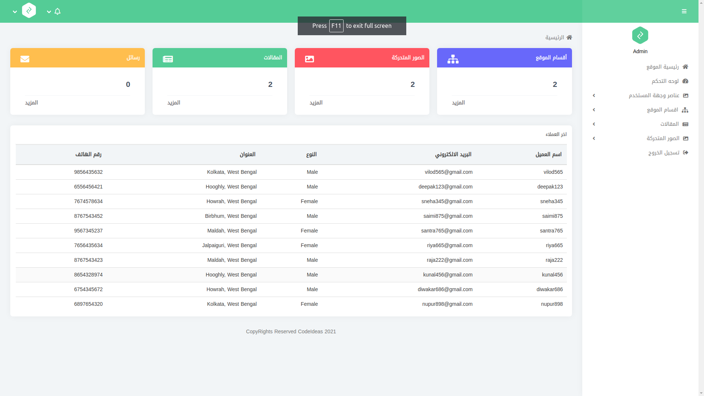
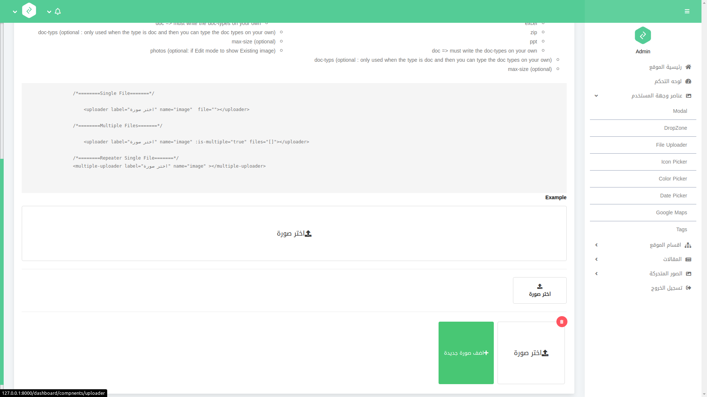
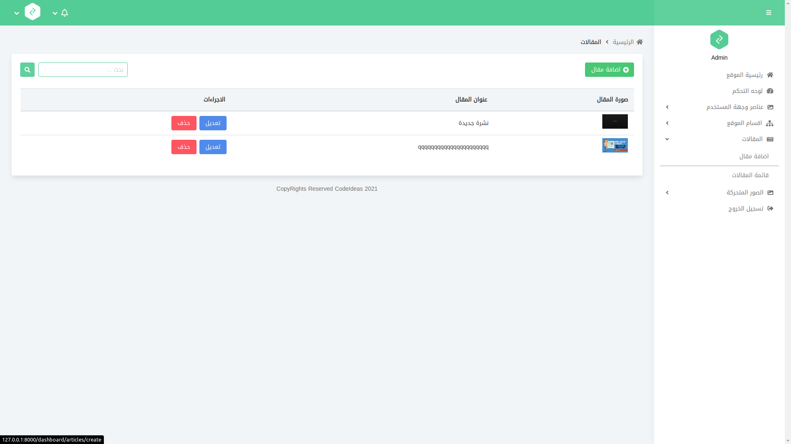
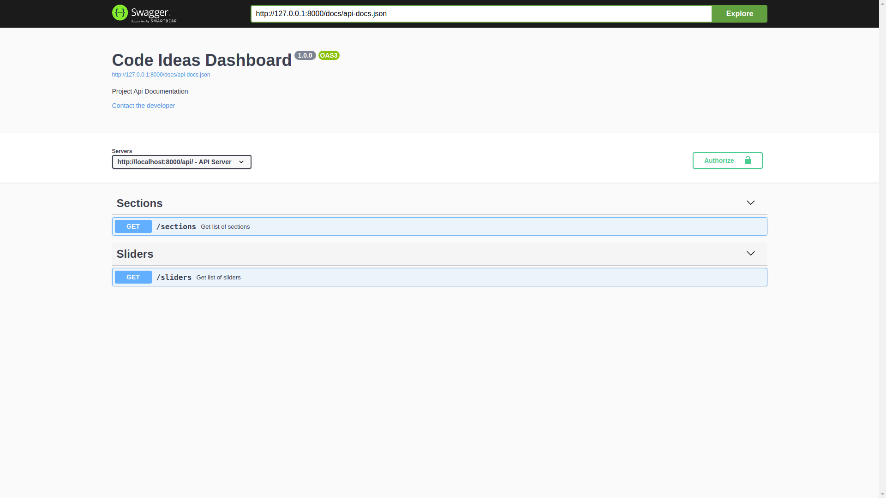

## Laravel DashBoard Demo

<a href="https://dashboard.codeideas.dev" target="_blank">Dashboard Demo</a>

<a href="https://dashboard.codeideas.dev/api/v1" target="_blank">API Demo</a>

## Features

Based on Laravel Boilerplate contains useful vue compontents like : dropzone, editor, uploader, map, multi select, sweet alert, icon and color picker.\
Arabic style Built with Bulma and contains stander packages, such as:

- [Laravel Collective](https://laravelcollective.com).
- [Laravel Filemanager](https://unisharp.github.io/laravel-filemanager/).
- [Consoletvs Charts](https://charts.erik.cat/).
- [Swagger Api Documentation](https://github.com/DarkaOnLine/L5-Swagger).
- [Laravel Debugbar](https://github.com/barryvdh/laravel-debugbar).

### Setup
---
Clone the repo and follow below steps.
1. Run `composer install`
2. Copy `.env.example` to `.env`
3. Set valid database credentials of env variables `DB_DATABASE`, `DB_USERNAME`, and `DB_PASSWORD`
4. Run `php artisan key:generate` to generate application key
5. Run `php artisan migrate --seed` to seed your database

Thats it... Run the command `php artisan serve`, you are good to go with your **Dashboard** application.\
Open your server `/api/v1` For Api Documentation

### Demo Credentials
---
*Make sure you have run the command `php artisan db:seed` before you use these credentials.*

**Email:** admin@dashboard.com\
**Password:** dashboard

## ScreenShots

## Dashboard

## Components

## CRUD

## API Documentation

## Contribution
Feel free to create any pull requests for the project. For proposing any new changes or features you want to add to the project, you can send us an email at following addresses.

    1. Front : sara@codeideas.dev
    2. Back : ahmed@codeideas.dev
